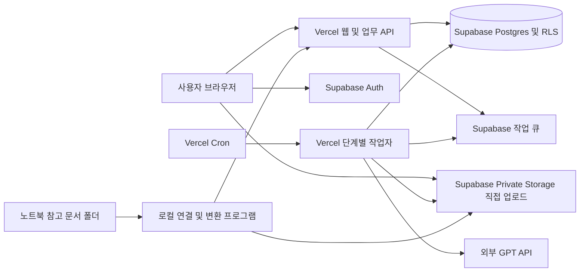

# Vercel·Supabase·MCP 기반 고객 미팅 플랫폼 개발 설계서

> 버전: 1.0 / 작성일: 2026-09-17 / 상태: 개발 착수용 추가 설계
> 사용자 결정: Vercel에 웹 플랫폼 배포, Supabase에 업무 DB 구성, 외부 GPT API로 회의록·제안서 생성, 클로바노트 녹음+TXT 동시 업로드 지원.
> 이번 산출물은 설계 문서다. 앱 개발, 서비스 가입, MCP 연결, DB 생성, 결제, 배포를 완료했다는 의미가 아니다.

## 1. 문서 관계와 변경 범위

- [기존 상세 기획서](<C:/Users/Demo/Desktop/BS SA Project/고객사_미팅_회의록_제안서_자동화_플랫폼_상세기획서.md>)의 고객사·미팅·요구사항·제안서·검토 기능은 유지한다.
- [GPT API 사용 가이드](<C:/Users/Demo/Desktop/BS SA Project/GPT_API_사용_가이드.md>)의 키 발급·가상 연결 시험은 계속 사용할 수 있다.
- 배포 위치, 업무 데이터 보관, 파일 업로드, 비동기 작업, API 키 운영 위치는 **본 추가 설계가 우선**한다.
- 기존 문서의 ‘앱과 업무 결과를 노트북에 저장’은 ‘Vercel 웹 앱 + Supabase 업무 DB·비공개 파일 저장소’로 바뀐다.
- 기존 제안서·회사 소개서 등 참고 문서의 원본 폴더는 노트북에 유지한다. 폴더 전체를 자동으로 Supabase나 GPT에 복제하지 않는다.

## 2. MCP 두 개의 역할

사용자의 ‘MCP 모델 두 개’는 **Vercel MCP와 Supabase MCP 서버 두 개를 개발 도구에 연결**하는 의미로 해석한다. MCP는 AI 모델이 아니라 개발 도구가 외부 서비스의 기능을 호출하는 연결 방식이다.

| 구분 | 역할 | 실제 서비스 운영에 필요한가 |
|---|---|---|
| Vercel MCP | 프로젝트·배포·로그 확인 등 개발·운영 보조 | 배포된 앱의 일반 사용자 요청 경로에는 사용하지 않음 |
| Supabase MCP | 개발 DB 구조 확인, 마이그레이션 등 지원 도구 활용 | 사용자 요청은 SDK/API·SQL로 처리 |
| OpenAI API | 회의록·요구사항·제안서 생성 | AI 기능 실행 시 사용 |

개발 도구의 MCP 로그인과 앱의 API 비밀 키는 별개다. MCP 연결만으로 GPT 결제·DB 스키마·사이트 배포가 자동 완료되지 않는다. 이번 세션에서 Vercel·Supabase용 실행 도구는 발견되지 않았으므로 연결 상태를 확인했다고 표시하지 않는다.

공식 문서: [Vercel MCP](https://vercel.com/docs/agent-resources/vercel-mcp), [Supabase MCP](https://supabase.com/docs/guides/ai-tools/mcp)

## 3. 권장 시스템 구성

| 구성 요소 | 배치 | 책임 |
|---|---|---|
| 웹 화면 | Vercel | 고객·미팅·업로드·편집·승인·작업 상태 |
| 웹 백엔드 | Vercel Functions | 세션·권한 검증, 작업 접수, GPT 호출, 결과 저장 |
| 인증 | Supabase Auth | 로그인, 사용자 식별, 세션 |
| 업무 DB | Supabase Postgres | 고객사·전사·요구사항·제안서·작업·감사 이력 |
| 파일 저장 | Supabase Storage의 private 버킷 | 업로드 녹음·TXT·출력 DOCX·PDF |
| 작업 큐 | Supabase Queues | 지속되는 작업 메시지와 재처리 |
| 작업 스케줄러 | Vercel Cron | 클라우드 작업자 호출·미처리 작업 복구 |
| GPT | OpenAI API | 텍스트 생성, 필요 시 외부 음성 전사 |
| 로컬 연결·작업 프로그램 | 현재 Windows 노트북 | 참고 폴더 검색·추출, 무거운 변환·문서 렌더링 |

웹 구현 기본안은 Next.js + TypeScript, Supabase SDK, OpenAI 공식 SDK다. 정확한 프레임워크·런타임 버전은 착수 시 Vercel 지원 범위를 확인하고 잠금 파일에 고정한다. 현재 문서는 애플리케이션 코드를 포함하지 않는다.



로컬 프로그램이 꺼져 있어도 로그인, 고객 관리, 검증 완료된 입력 또는 TXT 단독 입력의 회의록 생성, 기존 자료 조회는 가능하다. 새 로컬 문서 검색, 로컬 검사가 필요한 신규 녹음 묶음, 무거운 파일 변환, 지정된 문서 출력 작업은 프로그램이 연결될 때까지 대기한다.

## 4. 저장 위치와 외부 전송 범위

| 데이터 | 저장·처리 위치 | GPT 전송 |
|---|---|---|
| 업로드한 녹음 | Supabase 비공개 Storage | TXT 경로에서는 미전송; 외부 전사 선택 시 전송 |
| 업로드한 TXT | Supabase 비공개 Storage, 파싱 결과는 DB | 회의록·요구사항 생성에 필요한 텍스트 |
| 고객사·영업기회 정보 | Supabase DB | 생성에 필요한 최소 정보 |
| 참고 문서 원본 폴더 | 노트북 | 전체 파일 전송 안 함 |
| 참고 문서 검색 색인·임베딩 | 노트북 | 직접 전송 안 함 |
| 선택한 문서 발췌 | Supabase 근거 스냅샷 | 정책상 허용된 내용만 전송 |
| 회의록·요구사항·제안서 | Supabase DB | 재작성에 필요한 범위 |
| DOCX·PDF | Supabase private Storage, 사용자가 다운로드 가능 | 기본 미전송 |
| API 키 | Vercel 서버 측 비밀 환경 변수 | 인증에만 사용 |

‘TXT가 있으므로 녹음 미전송’이라는 표시는 **GPT로의 미전송**을 뜻한다. 녹음을 웹에서 업로드하면 Supabase에는 저장된다. 업로드 화면에서 이 차이를 명시한다.

문서 정책은 `cloud_storage_allowed`와 `ai_transfer_allowed`로 분리한다. 로컬 참고 문서의 발췌를 이 경로로 활용하려면 두 조건을 모두 충족해야 한다. 금지 문서는 로컬 검색 화면에서 확인할 수 있지만 클라우드 근거 저장·GPT 생성 대상에서 제외한다.

## 5. 녹음+TXT 동시 업로드

### 5.1 사용자 흐름

1. 로그인한 사용자가 고객사·미팅을 생성한다.
2. ‘녹음 파일’과 ‘음성 기록 TXT’ 영역에 각각 파일을 선택한다.
3. Vercel API가 미팅 접근 권한을 확인하고 입력 묶음·파일 예약 레코드를 만든다.
4. 브라우저가 인증된 Supabase Storage 업로드 경로로 파일을 직접 전송한다.
5. 각 파일의 업로드 상태를 표시한다. 중단되면 재개할 수 있게 한다.
6. 서버가 실제 저장된 객체의 소유권·크기·유형·완료 여부를 확인한다.
7. TXT 파싱과 원문 미리보기를 제공하고 사용자가 같은 미팅의 파일인지 확인한다.
8. 묶음 확정과 ‘분석 시작’ 후 회의록 작업을 큐에 넣는다.

### 5.2 직접 업로드가 필요한 이유

Vercel Functions는 요청·응답 본문 크기에 4.5MB 제한이 있으므로 대용량 파일 바이트를 Route Handler나 Server Action을 경유해 전달하지 않는다. API는 파일 ID·업로드 정책 등 작은 메타데이터만 처리한다. 파일 다운로드도 Vercel 응답 프록시 대신 비공개 객체의 짧은 수명 다운로드 URL을 사용한다. [Vercel 제한](https://vercel.com/docs/functions/limitations)

Supabase의 TUS 재개 업로드를 사용한다. 파일별 RLS와 인증 토큰을 검사하며 브라우저에 서버 비밀 키를 전달하지 않는다. 업로드 대상 경로는 미리 예약된 객체 경로로 제한한다. [재개 업로드](https://supabase.com/docs/guides/storage/uploads/resumable-uploads)

### 5.3 크기·형식·묶음 정책

- 앱 목표는 음성 500MB·180분, TXT·DOCX 20MB다. 실제 허용 크기는 가입 요금제·프로젝트 전역·버킷·앱 제한 중 가장 작은 값이다.
- Supabase의 실제 업로드 설정을 확인하기 전 500MB 지원을 완료로 표시하지 않는다. [파일 크기 설정](https://supabase.com/docs/guides/storage/uploads/file-limits)
- 녹음 M4A·MP3·WAV·AAC·AMR, 기록 TXT 우선·DOCX 보조라는 기존 지원 목표를 유지한다.
- 확장자와 클라이언트의 완료 신고만 신뢰하지 않는다. 파일 내용 검증 전 `quarantined`로 두고 재생·AI 사용을 차단한다.
- TXT는 제한된 크기의 구간으로 읽고 파싱한다. 복잡한 DOCX·압축 해제·대용량 음성 검사는 로컬 작업자가 처리할 수 있다.
- 한 파일이 실패하면 묶음은 대기한다. 사용자가 파일을 교체하거나 제외한 후 분석한다.
- 파일 경로는 `{organization_id}/{meeting_id}/{asset_id}/{safe_name}` 구조로 서버에서 생성한다. 같은 경로 덮어쓰기를 금지하고 새 버전은 새 객체로 저장한다.
- 원본 해시는 클라이언트 주장과 검증 완료 값을 구분한다. 작업자가 실제 바이트로 확인한 값만 무결성 근거로 사용한다.

## 6. Supabase 데이터베이스 설계

기존 상세 기획서 9절의 엔터티를 기반으로 아래 테이블을 구성한다. 모든 업무 테이블은 조직 경계와 버전 관계를 가진다.

| 영역 | 주요 테이블 | 요구사항 |
|---|---|---|
| 조직·권한 | organizations, memberships, opportunity_members | 초대 기반 가입, 역할 관리 |
| 고객·프로젝트 | customers, opportunities, meetings, participants | 조직·프로젝트 범위 FK |
| 파일·입력 | meeting_assets, input_bundles, upload_reservations | 실제 객체 경로·검증 상태·입력 버전 |
| 회의 기록 | transcript_versions, transcript_segments, minutes_versions | 출처 위치·확정 스냅샷 |
| 요구·업무 | requirements, requirement_revisions, requirement_evidence, action_items | 변경 이력·담당자 |
| 로컬 저장소 | repositories, connectors, document_metadata | 로컬 원본 위치는 클라우드에 전체 경로 대신 불투명 ID 사용 |
| 근거 | evidence_snapshots, evidence_links | 선택한 발췌·문서 버전·만료·전송 정책 |
| 제안서 | proposals, proposal_versions, proposal_sections, reviews, approvals | 승인된 버전 불변 |
| 작업·운영 | processing_jobs, job_steps, ai_requests, usage_reservations, audit_events | 재시도·비용·외부 요청 ID |
| 출력 | export_artifacts | 승인 버전·해시·객체 위치·대상 |

### 6.1 무결성

- UUID를 기본 ID로 사용하되 무작위 ID만으로 접근 제어를 대신하지 않는다.
- 조직 ID를 포함한 복합 FK 또는 동등한 검증으로 다른 조직의 고객·미팅 연결을 차단한다.
- 생성 작업에 `(organization_id, input_version, job_type, settings_hash)` 중복 방지 키를 둔다.
- 사용자가 입력한 조직 ID는 세션의 멤버십과 대조한다.
- 버전 번호·승인 해시·수정 충돌 토큰을 서버에서 관리한다.
- DB 변경은 순서가 있는 마이그레이션 파일로 관리한다. MCP에서 실행한 변경도 저장소에 재현 가능한 마이그레이션을 남긴다.

### 6.2 RLS 권한

| 주체 | 조회 | 변경 |
|---|---|---|
| 비로그인 | 업무 데이터 접근 불가 | 불가 |
| 조직 구성원 | 자신이 접근 가능한 고객·영업기회 | 역할과 프로젝트 배정 범위 내 |
| 검토자 | 배정된 문서·근거 | 검토·승인 정책에 따른 변경 |
| 관리자 | 설정 권한 범위 | 조직·역할 설정, 민감 문서는 별도 권한 |
| 로컬 연결 프로그램 | 배정된 작업의 최소 입력 | 해당 작업 결과만 제출 |

노출되는 테이블에 RLS를 활성화하고 SELECT·INSERT·UPDATE·DELETE 정책을 따로 정의한다. 멤버십·승인·작업 완료는 사용자가 임의 업데이트하지 못하게 하며 서버 명령 또는 제한된 DB 함수로 처리한다. 보안 함수는 고정된 `search_path`, 실행 권한 제한, 입력 검증을 적용한다. [RLS 공식 안내](https://supabase.com/docs/guides/database/postgres/row-level-security)

서버용 secret 또는 legacy service_role 자격 증명은 높은 권한이 있으므로 일반 사용자 요청의 권한 검사를 생략하는 근거로 사용하지 않는다. 사용자 작업은 가능한 한 사용자의 JWT 문맥으로 실행하고, 특권 작업은 검증된 최소 기능으로 분리한다.

## 7. Supabase Storage와 로그인

### 7.1 비공개 버킷

| 버킷 | 내용 | 다운로드 규칙 |
|---|---|---|
| meeting-inputs | 녹음·TXT·보조 메모 | 미팅 권한 및 검증 상태 확인 |
| proposal-exports | 내부용·고객용 DOCX·PDF | 대상 버전·승인·사용자 권한 확인 |
| temporary-assets | 변환 조각·임시 렌더링 | 작업자 한정, 짧은 보존 |

모든 버킷은 private으로 시작한다. DB 테이블 RLS와 `storage.objects` 정책은 별도로 구현한다. URL에 조직 ID가 포함되어 있다는 이유만으로 접근을 허용하지 않는다. 삭제·업로드·조회도 각각 통제한다. [Storage 접근 제어](https://supabase.com/docs/guides/storage/security/access-control)

다운로드 URL의 앱 초기 수명은 60초로 제안한다. 이미 발급한 URL은 만료 전까지 유효할 수 있으므로 권한 회수 후 ‘즉시 무효’라고 보장하지 않는다. 새 발급은 즉시 차단하고 긴 URL 수명을 금지한다.

### 7.2 로그인

- MVP는 Supabase Auth 이메일·비밀번호와 관리자 초대 기반으로 구성한다.
- 로그인과 회원가입만으로 조직 멤버십을 자동 획득하지 않는다.
- Next.js 서버에서 검증된 사용자 세션으로 API를 보호한다.
- 운영 도메인과 개발 도메인의 인증 리다이렉트 주소를 분리한다.
- 클라이언트에서 사용할 publishable 키와 서버 secret 키를 구분한다. 공개 키가 안전하게 사용되려면 RLS가 실제로 적용되어야 한다. [키 유형 안내](https://supabase.com/docs/guides/getting-started/api-keys)

## 8. 비동기 작업과 실행 시간 제한

### 8.1 작업을 나누는 기준

| 단계 | 실행 위치 | 완료 단위 |
|---|---|---|
| TXT 파싱·구간화 | Vercel 작업자, 크기에 따라 분할 | 전사 구간 묶음 |
| 회의 요약·요구사항 | Vercel → OpenAI | 구간별 결과·최종 통합 |
| 로컬 문서 검색 | 노트북 연결 프로그램 | 요청별 상위 근거·버전 |
| 제안서 작성 | Vercel → OpenAI | 목차 및 절별 결과 |
| 대용량 음성 검사·변환 | 노트북 작업 프로그램 | 검증·변환된 오디오 조각 |
| 외부 음성 전사 | Vercel → OpenAI | 조각별 결과와 시간 오프셋 |
| DOCX·PDF 렌더링 | 초기에는 노트북 작업 프로그램 | 승인 버전별 파일 |

Supabase Edge Functions도 실행 시간·메모리·CPU 제한이 있으므로 음성 변환이나 Office 문서 렌더링의 무제한 실행 서버로 취급하지 않는다. [Edge Functions 제한](https://supabase.com/docs/guides/functions/limits)

### 8.2 큐·스케줄러 계약

1. 업무 DB에 작업과 outbox 이벤트를 같은 트랜잭션으로 기록한다.
2. 발행기가 outbox 이벤트를 Supabase Queues에 전달한다. 발행 중단으로 누락되지 않도록 미발행 이벤트를 재검사한다.
3. Vercel Cron이 인증된 dispatcher를 호출하고, dispatcher는 처리 가능한 작업 1개 또는 제한된 묶음을 가져온다.
4. 작업자는 visibility timeout과 DB 임대를 사용하고 완료 전에 결과·단계 상태를 저장한다.
5. 결과가 확정되면 메시지를 확인 처리한다. 중복 메시지가 와도 입력 버전·단계 키로 결과를 중복 생성하지 않는다.
6. 실패는 일시 오류·영구 오류로 구분한다. 반복 실패는 검토 대기 목록으로 옮긴다.

Supabase Queues는 작업 저장·전달 계층이며 코드를 자동 실행하는 작업자가 아니다. 앱의 DB·API 호출까지 정확히 한 번 실행되는 것으로 가정하지 않는다. [Queues 안내](https://supabase.com/docs/guides/queues)

각 함수는 요금제의 실행 한도보다 짧은 자체 마감 시간을 갖는다. 외부 API 호출 시간 제한과 결과 저장 시간을 포함해 여유를 두고, 작업을 작게 나눈다. 응답 뒤 메모리에 남긴 Promise만으로 처리 지속을 보장하지 않는다. 타임아웃 후 외부 요청의 완료 여부가 모호하면 비용·상태를 미확정으로 남기고 무조건 재호출하지 않는다.

### 8.3 Cron 요금제 전제

이 설계의 무인 클라우드 작업 진행은 **분 단위 Cron이 가능한 Vercel 요금제**를 전제로 한다. 확인 시점의 공식 안내에서는 Hobby는 하루 1회, Pro·Enterprise는 분 단위 실행이 가능하다. 실제 선택 전 현재 제한을 재확인한다. [Cron 제한](https://vercel.com/docs/cron-jobs/usage-and-pricing)

Hobby에서 매분 복구 작업이 돌아간다고 가정하지 않는다. 해당 요금제를 쓰려면 개발용 수동 dispatcher로 검증하되, 이를 상시 운영 완료로 간주하지 않는다. 유료 요금제 구매는 이 문서 작성으로 실행하지 않는다.

## 9. 로컬 문서 저장소 연결과 무거운 작업

Vercel 서버는 사용자의 `C:` 폴더를 직접 읽을 수 없다. 따라서 원래 요구한 폴더 검색을 유지하려면 로컬 연결 프로그램이 필요하다.

- 사용자가 지정한 폴더만 읽기 전용으로 등록한다.
- 로컬에서 텍스트 추출·검색 색인을 유지한다. 노트북 RAM 16GB 기준 초기 동시 색인 1건으로 제한한다.
- 연결 프로그램이 HTTPS로 배정된 작업을 가져오는 outbound 방식으로 동작한다. PC 포트를 인터넷에 공개하지 않는다.
- 장치별 만료·회수 가능한 전용 토큰을 발급한다. Supabase 서버 secret이나 OpenAI 키를 PC에 배포하지 않는다.
- Vercel API는 장치·조직·작업·허용 범위를 확인하고 짧은 수명의 입력/출력 Storage 권한만 제공한다.
- 검색 요청에는 요구사항과 허용 고객 범위만 포함한다. 검색 결과 중 정책상 허용된 발췌만 클라우드로 올린다.
- 발췌·작업 결과의 메타데이터 요청도 Vercel 본문 한도를 넘지 않도록 분할한다. 큰 출력 파일·변환 오디오는 배정된 경로로 Storage에 직접 업로드한다.
- 오디오 검사·변환과 DOCX·PDF 렌더링은 같은 연결 프로그램의 별도 작업 모듈로 실행한다.
- 원본 문서를 GPT 명령으로 열거나 실행하지 않는다. 로컬 도구는 사전 정의된 작업만 수행한다.
- 장치 오프라인 시 `waiting_for_connector`로 표시한다. 클라우드에 없는 원문을 검색했다고 표시하지 않는다.
- 발췌가 이미 업로드된 제안서 재작성은 장치 없이 가능할 수 있으나 ‘마지막 확인 시각’을 표시한다.
- 이후 상시 운영이 필요하면 로컬 작업 모듈을 사내 상시 서버로 이동한다. MCP를 세 번째로 추가해야 하는 것은 아니다.

## 10. 환경 변수와 비밀 정보

다음 이름은 앱 구현에서 사용할 설정 계약이다. 각 서비스가 모두 자동 생성해 준다는 의미는 아니다.

| 이름 | 위치 | 노출 가능 여부 |
|---|---|---|
| NEXT_PUBLIC_SUPABASE_URL | Vercel 공개 설정 | 공개 가능 |
| NEXT_PUBLIC_SUPABASE_PUBLISHABLE_KEY | Vercel 공개 설정 | 공개 가능, RLS 전제 |
| SUPABASE_SECRET_KEY | Vercel 서버 전용 | 공개 금지 |
| OPENAI_API_KEY | Vercel 서버 전용 | 공개 금지 |
| OPENAI_MINUTES_MODEL | 서버 설정 | 초기 gpt-4.1-mini |
| OPENAI_PROPOSAL_MODEL | 서버 설정 | 초기 gpt-4.1 |
| OPENAI_TRANSCRIBE_MODEL | 서버 설정 | 초기 gpt-4o-transcribe-diarize |
| CRON_SECRET | Cron 호출 검증 | 공개 금지 |
| APP_BASE_URL | 환경별 설정 | 해당 배포 주소 |

서버 비밀 변수에 `NEXT_PUBLIC_` 접두사를 붙이지 않는다. 개발·Preview·Production 환경은 키와 Supabase 프로젝트를 분리한다. 앱의 설정 화면은 등록 상태·모델·정책을 보여주며 운영 GPT 키를 DB 일반 컬럼에 저장하지 않는다.

기존 GPT 가이드의 PowerShell 키 입력은 로컬 연결 시험용으로만 사용한다. 배포 앱은 Vercel의 서버 환경 변수에서 키를 읽는다. MCP용 OAuth 권한·개인 액세스 토큰은 이 표의 앱 비밀 키로 대체하지 않는다.

## 11. 두 MCP 연결 절차

### 11.1 Vercel MCP

1. 개발용 Vercel 계정·팀을 준비한다.
2. 사용하는 개발 도구의 MCP 설정에 공식 서버 `https://mcp.vercel.com`을 등록한다.
3. 지원되는 인증 흐름으로 로그인하고 대상 팀·프로젝트 접근을 확인한다.
4. 먼저 프로젝트 조회·문서 조회 등 읽기 작업으로 연결을 확인한다.
5. 배포·로그·환경 설정은 실제 제공 도구 범위를 확인한 뒤 사용한다. 모든 기능이 MCP 하나로 제공된다고 가정하지 않는다.

등록 방법은 사용 중인 도구에 맞는 공식 안내를 따른다. 이 문서는 설정 파일을 실제 수정하지 않았다. [Vercel MCP 연결 안내](https://vercel.com/docs/agent-resources/vercel-mcp)

### 11.2 Supabase MCP

1. 가상 데이터만 사용하는 개발용 Supabase 프로젝트를 준비한다.
2. 공식 서버 `https://mcp.supabase.com/mcp`를 등록하고 로그인한다.
3. URL의 `project_ref`로 개발 프로젝트에 범위를 제한한다.
4. 초기 점검은 `read_only=true`를 사용한다. 이 모드에서는 DB 마이그레이션을 실행할 수 없다.
5. 개발 스키마 변경 시 대상 프로젝트·권한을 확인해 쓰기 모드를 사용하고, 변경을 마이그레이션으로 남긴다.
6. 운영 프로젝트를 연결해야 할 때는 읽기 전용·기능 그룹 제한을 우선 적용하고 민감한 실제 행을 개발 도구에 불필요하게 노출하지 않는다.

프로젝트 제한 연결 주소의 형태는 `https://mcp.supabase.com/mcp?project_ref=<개발프로젝트ID>&read_only=true`다. 실제 프로젝트 ID로 바꿔야 하며 비밀 키를 주소에 넣지 않는다. [Supabase MCP 설정](https://supabase.com/docs/guides/ai-tools/mcp)

## 12. API 변경 계약

| 경로 | 역할 |
|---|---|
| POST /api/meetings/{id}/uploads | 접근 확인·객체 경로 예약·크기 정책 반환 |
| POST /api/uploads/{id}/complete | 실제 객체 존재·크기 검증, 파일 검사 작업 등록 |
| POST /api/meetings/{id}/input-bundles | 녹음·TXT 묶음 버전 생성 |
| POST /api/input-bundles/{id}/analyze | 준비 상태·권한·예산 검사 후 작업 접수 |
| GET /api/jobs/{id} | 사용자에게 허용된 진행 상황 조회 |
| GET /api/internal/dispatch | Cron 인증 전용, 제한된 큐 소비 |
| POST /api/connectors/poll | 등록 장치에 허용된 작업 임대 |
| POST /api/connectors/jobs/{id}/complete | 장치·임대 토큰·출력 검증 후 완료 처리 |
| POST /api/proposal-versions/{id}/exports | 승인 상태·대상 확인 후 출력 예약 |
| POST /api/assets/{id}/download | 권한 확인 후 짧은 다운로드 URL 발급 |

사용자 API에는 세션 검증과 요청 위조 방어를 적용한다. 내부 dispatcher는 일반 사용자에게 공개하지 않는다. 큐 소비·비용 예약·작업 완료는 브라우저가 직접 DB에서 변경할 수 없게 한다.

## 13. 개발 폴더 구조 초안

```text
apps/
  web/                  # Next.js 화면·업무 API·클라우드 작업자
  local-connector/      # Windows 폴더 검색·변환·렌더링 작업자
packages/
  contracts/            # API·작업·AI 출력 스키마
  domain/               # 권한·버전·승인·정책
  ai/                   # OpenAI 어댑터·사용량·검증
  templates/            # 회의록·제안서 출력 템플릿
supabase/
  migrations/           # 테이블·RLS·제한된 함수·큐 설정
  seed/                 # 가상 테스트 데이터
tests/
  integration/          # DB·Storage·작업 복구
  e2e/                  # 업로드부터 출력까지
docs/                   # 설치·운영·복구 절차
```

이는 개발 구조 제안이며 현재 생성된 디렉터리 목록이 아니다. 로컬 연결 프로그램의 언어·패키징 방식은 Windows 변환·렌더링 도구 호환성 시험 후 확정한다.

## 14. 개발·배포 순서

| 단계 | 구현·확인 항목 | 완료 기준 |
|---|---|---|
| 1. 환경 준비 | Git 저장소, Vercel·Supabase 개발 프로젝트, GPT 키, 두 MCP | 실제 계정·연결 확인 기록 |
| 2. 업무·권한 | Auth, 조직·고객·미팅, RLS, 기본 화면 | 두 조직 간 조회·수정 차단 |
| 3. 파일 | private Storage, TUS, 묶음 확정, TXT 파싱 | 녹음+TXT·중단 재개·실패 분기 통과 |
| 4. 작업·GPT | outbox·큐·Cron, 회의록·요구사항·비용 | 브라우저 종료 후 처리·중복 방지 |
| 5. 로컬 연결 | 장치 등록, 지정 폴더 색인·검색 | 허용 발췌만 전달, 오프라인 대기 |
| 6. 제안서 | 근거 연결, 절별 작성, 검토·승인 | 출처·버전·승인 검증 |
| 7. 변환·출력 | 음성 전사 대체 경로, DOCX·PDF | 시간 근거·출력 품질 확인 |
| 8. 운영 배포 | 별도 운영 DB·비밀 변수·도메인·백업 | 전체 인수 시나리오와 복구 시험 |

Git 연결 후 Vercel에 프로젝트를 등록하고 빌드·환경 변수를 설정한다. Preview는 개발 Supabase를 사용하고 Production은 운영 Supabase를 사용한다. 실제 사용자 데이터가 있는 프로젝트를 모든 Preview에서 공유하지 않는다.

마이그레이션은 개발 DB에서 검증하고 운영에 순서대로 적용한다. 앱 롤백이 DB 변경을 자동 취소하지 않으므로 스키마는 가능한 한 하위 호환 방식으로 변경한다. 로그인 리다이렉트·Cron 인증·직접 업로드·다운로드를 실제 배포 주소에서 확인한다.

## 15. 검증 및 인수 기준

1. 비로그인 사용자는 고객·파일·제안서에 접근하지 못한다.
2. 서로 다른 조직의 두 계정으로 DB·Storage·다운로드·작업 API 접근을 교차 시험한다.
3. 4.5MB를 넘는 파일이 Vercel 업로드 본문을 경유하지 않는다.
4. 설정된 허용 크기의 큰 녹음이 TUS로 업로드·중단·재개된다.
5. 두 파일 중 하나가 미완료이면 GPT가 호출되지 않는다.
6. 정상 TXT 경로에서는 OpenAI 음성 전사가 호출되지 않는다.
7. 텍스트 분석 시 외부 전송 정책을 통과한 입력만 사용한다.
8. 작업 중 함수 종료·Cron 중복·큐 재전달에도 결과 버전이 중복 생성되지 않는다.
9. 사용자가 브라우저를 닫아도 클라우드 텍스트 작업이 계속된다.
10. 노트북 오프라인 시 로컬 검색·출력은 대기하며 성공으로 표시하지 않는다.
11. 장치 토큰 회수 후 새 작업 조회·결과 제출이 차단된다.
12. GPT 키·Supabase secret·Cron secret이 브라우저 번들과 로그에 없다.
13. 미승인 문서의 고객용 출력과 권한 없는 다운로드 발급이 차단된다.
14. 발급된 다운로드 URL의 만료 동작을 확인하고 즉시 회수 한계를 문서화한다.
15. 음성 분할 시간과 문서 발췌 버전이 최종 근거까지 유지된다.
16. 예산 차단·429·결제 부족·서비스 장애에서 무한 재시도가 없다.
17. 백업에서 DB·파일을 함께 복원하고 삭제 목록을 재적용한다.
18. 개발·운영 환경의 DB와 비밀 변수가 섞이지 않는다.

## 16. 비용·백업·운영

- 비용 항목은 Vercel 요금제·함수 실행·전송량, Supabase DB·Storage·전송량·백업, OpenAI 토큰·음성 처리로 나눈다.
- 두 MCP 연결이 이 서비스 비용을 대신하지 않는다. 현재 가격·계정 자격·월 사용량을 확인하기 전 고정 월 비용을 제시하지 않는다.
- 500MB 업로드 목표, 분 단위 Cron, 팀 사용·상업적 용도에 맞는 요금제를 선택한다.
- Vercel 함수와 Supabase 프로젝트 리전은 가깝게 배치하는 것을 검토한다. 해당 설정만으로 OpenAI를 포함한 모든 데이터가 같은 국가에서 처리된다고 주장하지 않는다.
- DB 백업은 Storage 파일 바이트까지 자동 복원하는 수단으로 간주하지 않는다. 파일 복사·보존·복구 절차를 별도로 구성한다. [Supabase 백업 범위](https://supabase.com/docs/guides/platform/backups)
- 보존 종료 시 DB, Storage, 근거 스냅샷, 임시 파일, 로컬 캐시, 백업 복구용 삭제 목록을 함께 관리한다.
- 초기에 가상 자료로 배포·권한·복구를 확인한 뒤 실제 업무 자료를 등록한다.

## 17. 개발 착수 시 확인할 항목

| 항목 | 현재 상태 |
|---|---|
| 서비스 구성 | Vercel + Supabase + OpenAI로 설계 반영 |
| Vercel 계정·팀·요금제·프로젝트 | 아직 확인하지 않음 |
| Supabase 개발·운영 프로젝트·리전 | 아직 확인하지 않음 |
| 두 MCP 연결 | 이번 세션에서 실행 도구 미발견, 별도 연결 확인 필요 |
| GPT API 결제·키·모델 접근 | 가이드 제공, 실제 연결 시험 미실행 |
| Git 저장소·배포 브랜치 | 개발 착수 시 결정 |
| 실제 클로바노트 녹음+TXT 샘플 | 검증용 샘플 준비 필요 |
| 로컬 참고 폴더·회사 템플릿 | 사용자가 지정할 대상 확인 필요 |

이 항목들은 문서 작성의 누락이 아니라 실제 개발·배포에서 확인할 외부 계정 및 입력 자료다. 현재 추가 설계서를 기준으로 기능 구현과 환경 연결을 단계적으로 진행할 수 있다.
